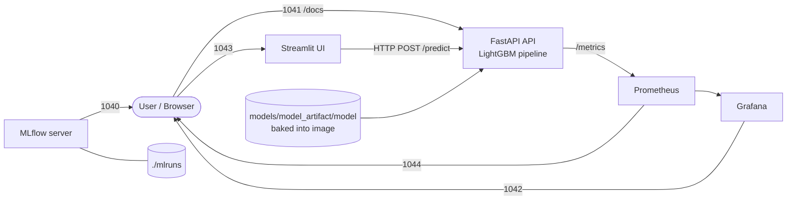

# ✈️ Flight Delay Prediction

An end-to-end machine-learning project that predicts a flight's **arrival delay (in minutes)** from information known before departure. It covers the full lifecycle: data cleaning, feature engineering, LightGBM training with MLflow tracking, a FastAPI inference service, a Streamlit UI, Prometheus/Grafana monitoring, Docker Compose orchestration, and a GitHub Actions CI/CD pipeline.


---

## Table of Contents

1. [What this project does](#what-this-project-does)
2. [Architecture](#architecture)
3. [Project structure](#project-structure)
4. [Tech stack](#tech-stack)
5. [Machine-learning pipeline](#machine-learning-pipeline)
6. [Model results](#model-results)
7. [Getting started](#getting-started)
8. [Configuration](#configuration)
9. [API reference](#api-reference)
10. [Streamlit application](#streamlit-application)
11. [MLflow](#mlflow)
12. [Docker and Docker Compose](#docker-and-docker-compose)
13. [Monitoring: Prometheus and Grafana](#monitoring-prometheus-and-grafana)
14. [Testing](#testing)
15. [CI/CD](#cicd)
16. [Deployment](#deployment)
17. [Known limitations](#known-limitations)
18. [Documentation](#documentation)

---

## What this project does

- **Problem type:** supervised **regression**. The target is the continuous `ARR_DELAY` column (minutes). A negative value means the flight is predicted to arrive early. There is no delayed / not-delayed classification and no probability or confidence score.
- **Inputs (8 fields per flight):** flight date, scheduled departure time, scheduled arrival time, scheduled duration, distance, carrier, origin airport, destination airport.
- **Model:** a scikit-learn `Pipeline` (`preprocessor` → `model`) wrapping a `LightGBM` `LGBMRegressor`, tracked and stored with MLflow.
- **Serving:** FastAPI loads the pipeline once at startup and exposes `/predict`, `/health`, `/model` and Prometheus `/metrics`. Streamlit is a thin HTTP client on top of it.
- **No historical lookups:** the model uses only the fields in the request. It does not query previous flights or prior-delay statistics at inference time (`/model` reports `historical_features_used: false`).

---

## Architecture

### Runtime (Docker Compose)



### Training flow

```text
data/*.csv
  → load_data()                     concatenate all monthly CSVs
  → clean_data()                    filter cancelled/diverted/invalid rows, IQR outlier removal on ARR_DELAY
  → split_data()                    chronological 80/20 split by FL_DATE
  → build_features()                calendar, time, cyclical, route/carrier and distance features
  → ColumnTransformer               constant imputation (numeric) + sparse one-hot (categorical)
  → LGBMRegressor                   wrapped together with the preprocessor in one sklearn Pipeline
  → RMSE / MAE / R² (train + test)
  → MLflow                          params, metrics, feature_importance.csv, model
```

### Inference flow

```text
POST /predict (FlightRequest JSON)
  → Pydantic validation             unknown fields rejected (extra="forbid")
  → pandas DataFrame
  → build_features()                same code path as training
  → select the 29 columns the fitted preprocessor expects
  → NaN / missing-column checks
  → Pipeline.predict()
  → PredictionResponse              prediction rounded to 2 decimals
```

Training and serving share `build_features()`, and the API selects columns from the fitted preprocessor's `feature_names_in_`. This keeps the serving feature contract identical to training.

---

## Project structure

```text
flight_delay_prediction/
├── .github/
│   └── workflows/
│       ├── ci.yml                     Run pytest on push / PR to main and develop
│       ├── cd.yml                     Build and push Docker image to GHCR after CI succeeds on main
│       └── pytest.ini                 Copy of the root pytest config
├── app/
│   └── app.py                         Streamlit client (calls the API over HTTP)
├── config/
│   └── config.py                      Central configuration (data, model, features, MLflow, API)
├── data/                              Monthly flight CSVs (git-ignored, not in the repo)
├── docs/                              Detailed project documentation (see "Documentation")
├── mlruns/                            Local MLflow file store (experiment runs, metrics, params)
├── models/
│   └── model_artifact/model/          Bundled MLflow model served by the API
│       ├── MLmodel
│       ├── model.pkl                  Fitted sklearn Pipeline (cloudpickle)
│       ├── conda.yaml / python_env.yaml / requirements.txt
│       └── registered_model_meta
├── monitoring/
│   ├── prometheus/
│   │   └── prometheus.yml             Scrapes api:8000/metrics every 15s
│   └── grafana/
│       ├── dashboards/
│       │   └── flight_delay_dashboard.json
│       └── provisioning/
│           ├── datasources/prometheus.yml
│           └── dashboards/dashboards.yml
├── nginx/
│   └── flight-delay.duckdns.org.conf  Reverse-proxy site config for the VPS (not run by Compose)
├── notebook/
│   └── note1.ipynb                    Exploratory analysis
├── src/
│   ├── api/
│   │   ├── main.py                    FastAPI app, endpoints, Prometheus instrumentation
│   │   ├── model_loader.py            Loads and validates the MLflow pipeline; holds shared model state
│   │   └── schemas.py                 Pydantic request / response models
│   ├── data/
│   │   ├── load.py                    Load and concatenate monthly CSVs
│   │   ├── clean_data.py              Training-time filtering and outlier removal
│   │   └── split_data.py              Chronological train/test split
│   ├── features/
│   │   └── build_feature.py           Feature engineering (shared by training and API)
│   ├── models/
│   │   └── train.py                   Training, evaluation and MLflow logging
│   └── preprocessing/
│       ├── preprocess.py              ColumnTransformer (imputer + one-hot encoder)
│       └── target_encoder.py          Out-of-fold target encoder (tested, not used in the active pipeline)
├── tests/
│   ├── load/
│   │   └── locustfile.py              Locust load-test scenarios
│   ├── test_api.py                    API endpoint tests (with a fake model)
│   ├── test_build_features.py         Feature-engineering tests
│   └── test_target_encoding.py        Preprocessor and target-encoder tests
├── .dockerignore
├── .gitignore
├── Dockerfile
├── docker-compose.yml
├── pytest.ini
├── requirements.txt
└── README.md
```

---

## Tech stack

| Area | Tools (pinned in `requirements.txt`) |
| --- | --- |
| Language | Python 3.11 (Docker image and CI) |
| ML | LightGBM 4.7.0, scikit-learn 1.9.0, pandas 2.3.3, NumPy 2.4.6, SciPy 1.17.1 |
| Experiment tracking | MLflow 3.15.1 |
| API | FastAPI 0.141.1, Uvicorn 0.52.4, Pydantic (via FastAPI) |
| UI | Streamlit 1.62.0, requests 2.34.2 |
| Metrics | prometheus-fastapi-instrumentator 8.1.0 |
| Testing | pytest 9.1.1, httpx 0.28.1 (FastAPI `TestClient`), Locust (load tests, not in `requirements.txt`) |
| Infrastructure | Docker, Docker Compose, Prometheus, Grafana, Nginx (VPS config), GitHub Actions, GHCR |

---

## Machine-learning pipeline

### Data

`load_data()` reads and concatenates every `data/*.csv` (sorted by filename). The CSVs are not committed (`data/` and `*.csv` are git-ignored), so training requires you to supply your own files with this schema:

```text
YEAR, QUARTER, MONTH, FL_DATE, OP_UNIQUE_CARRIER, ORIGIN_AIRPORT_ID, ORIGIN,
DEST_AIRPORT_ID, DEST, CRS_DEP_TIME, CRS_ARR_TIME, ARR_DELAY, CANCELLED,
DIVERTED, CRS_ELAPSED_TIME, DISTANCE
```

Scheduled times are `HHMM` values (for example `0500` or `1430`).

### Cleaning (`src/data/clean_data.py`)

1. Require `CANCELLED`, `DIVERTED`, `CRS_ELAPSED_TIME` and `ARR_DELAY` columns.
2. Drop cancelled and diverted flights.
3. Drop rows with `CRS_ELAPSED_TIME <= 0`.
4. Drop rows with a missing `ARR_DELAY`.
5. Remove `ARR_DELAY` outliers outside the 1.5 × IQR bounds.

### Split (`src/data/split_data.py`)

Rows are sorted by `FL_DATE`. The earliest 80% are used for training and the latest 20% for testing, so the model is evaluated on later flights than it was trained on. The preprocessor is fitted on the training set only.

### Feature engineering (`src/features/build_feature.py`)

`build_features()` validates the raw columns, then derives the model input. The final model uses **29 features** (list defined in `config/config.py`):

| Group | Features |
| --- | --- |
| Raw numeric | `CRS_ELAPSED_TIME`, `DISTANCE` |
| Calendar | `year`, `month`, `quarter`, `day`, `day_of_week`, `week_of_year`, `is_weekend` |
| Scheduled time | `departure_hour`, `departure_minute`, `departure_time_minutes`, `arrival_hour`, `arrival_minute`, `arrival_time_minutes` |
| Cyclical (sin / cos) | `departure_hour`, `day_of_week`, `month` |
| Derived numeric | `distance_log` (`log1p(DISTANCE)`), `is_peak_departure` (hours 7–9 and 16–19) |
| Categorical | `OP_UNIQUE_CARRIER`, `ORIGIN`, `DEST`, `route` (`ORIGIN_DEST`), `carrier_origin` (`CARRIER_ORIGIN`), `departure_period` (night / morning / afternoon / evening) |

It raises `ValueError` on invalid dates, invalid `HHMM` times, negative distance, missing features, or NaN model inputs. The optional `history` argument is accepted for compatibility but no historical statistics are computed.

### Preprocessing (`src/preprocessing/preprocess.py`)

A `ColumnTransformer` with:

- **Numeric:** `SimpleImputer(strategy="constant", fill_value=0)`
- **Categorical:** `OneHotEncoder(handle_unknown="ignore", sparse_output=True)`, so unseen carriers or airports are ignored instead of raising errors.

### Model (`src/models/train.py`)

`LGBMRegressor` with the following hyperparameters:

```text
num_leaves=63, max_depth=-1, learning_rate=0.10, n_estimators=1000,
min_child_samples=200, reg_alpha=0.0, reg_lambda=1.0, colsample_bytree=1.0,
n_jobs=-1, random_state=42
```

The preprocessor and model are wrapped in one sklearn `Pipeline` with steps named `preprocessor` and `model`. The API validates these names at startup.

---

## Model results

Metrics come from the MLflow runs committed in `mlruns/` (experiment `flight_arr_delay_champion_model1`, chronological split, RMSE and MAE in minutes):

| Run | Train rows | Test rows | Test RMSE | Test R² |
| --- | ---: | ---: | ---: | ---: |
| `7dc7a612…` (**bundled model**) | 80,000 | 20,000 | 17.71 | 0.037 |
| `3f939f23…` | 800,000 | 200,000 | 18.24 | 0.035 |
| `6ecc72ac…` (largest) | 4,000,000 | 1,000,000 | 16.96 | 0.059 |

The model bundled in `models/model_artifact/model` comes from run `7dc7a612afa34edd92e44cc98a63bf8e` (test MAE 13.47, train R² 0.46). Test R² is low in every run: arrival delay is hard to predict from schedule-only features, and the model shows a large train/test gap. Treat this project as a complete, working ML system rather than a highly accurate delay predictor.

---

## Getting started

### Prerequisites

- Python 3.11 (the Docker image and CI use 3.11)
- Docker and Docker Compose (only for the containerized setup)
- The bundled model at `models/model_artifact/model` (already in the repo). The data CSVs are only needed for training.

### Option A: Run everything with Docker Compose

```bash
docker compose up --build
```

| Service | URL |
| --- | --- |
| Streamlit UI | http://localhost:1043 |
| FastAPI (Swagger UI) | http://localhost:1041/docs |
| Prometheus | http://localhost:1044 |
| Grafana | http://localhost:1042 |
| MLflow UI | http://localhost:1040 |

Stop with `docker compose down`.

### Option B: Run locally without Docker

```bash
python -m venv .venv
source .venv/bin/activate            # Windows PowerShell: .\.venv\Scripts\Activate.ps1
pip install -r requirements.txt

# Point the API at the bundled model (the code default is the Docker path /app/model_artifact)
export MLFLOW_MODEL_URI=models/model_artifact/model
uvicorn src.api.main:app --host 127.0.0.1 --port 8000
```

In a second terminal, start the UI. `API_URL` must be set because the code default targets the Compose port (`http://127.0.0.1:1041`):

```bash
source .venv/bin/activate
export API_URL=http://127.0.0.1:8000
streamlit run app/app.py
```

Open http://127.0.0.1:8501 for Streamlit and http://127.0.0.1:8000/docs for the API. You can put these variables in a `.env` file instead of exporting them; `python-dotenv` loads it automatically.

Quick check of the model loader:

```bash
python -m src.api.model_loader
```

### Train a model

Training needs the monthly CSVs in `data/` and an MLflow tracking server. `train.py` sets the tracking URI when it is imported. The default is `http://127.0.0.1:1040`, which is where the Compose `mlflow` service listens:

```bash
docker compose up -d mlflow
python -m src.models.train                      # all rows in data/*.csv
python -m src.models.train --sample-size 100000  # quick experiment (earliest N cleaned rows)
```

To use a different tracking server, set `MLFLOW_TRACKING_URI`. Training logs the run to MLflow. To serve the new model, point `MLFLOW_MODEL_URI` at its artifact directory (or replace `models/model_artifact/model`, which is what the Docker image copies).

---

## Configuration

All settings live in `config/config.py` and are read from environment variables (`.env` is loaded with `python-dotenv`).

| Variable | Default in code | Used by | Purpose |
| --- | --- | --- | --- |
| `MLFLOW_MODEL_URI` | `/app/model_artifact` | API | Path or URI of the MLflow model to serve |
| `MLFLOW_TRACKING_URI` | `http://127.0.0.1:1040` | Training | MLflow tracking server |
| `MLFLOW_EXPERIMENT_NAME` | `flight_arr_delay_champion_model1` | Training | MLflow experiment |
| `API_URL` | `http://127.0.0.1:1041` | Streamlit | Base URL of the FastAPI service |
| `API_HOST` / `API_PORT` | `0.0.0.0` / `8000` | Docker `CMD` | Uvicorn bind address (set as image `ENV`) |
| `TRAINING_YEAR` | `2025` | Config only | Defined but not used by the training flow |

`.env` is git-ignored and excluded from the Docker image. Do not commit secrets.

---

## API reference

Entry point: `src.api.main:app` (title "Flight Arrival Delay Prediction API", version `1.0.0`). The model is loaded once during application startup; if it cannot be loaded or validated, the app fails to start.

| Method | Endpoint | Description |
| --- | --- | --- |
| `GET` | `/` | Service name, version and endpoint list |
| `GET` | `/health` | `{"status": "healthy", "model_loaded": true, "model_type": "Pipeline"}` (or `unhealthy` when no model is loaded) |
| `GET` | `/model` | Model URI, pipeline steps, model / preprocessor type, expected columns, `historical_features_used`. Returns 503 if no model is loaded |
| `POST` | `/predict` | Predict arrival delay for one flight |
| `GET` | `/metrics` | Prometheus metrics |
| `GET` | `/docs` | Interactive Swagger UI |

### `POST /predict`

Request body (all fields required, unknown fields such as `ARR_DELAY` are rejected with 422):

```json
{
  "FL_DATE": "2026-08-22",
  "CRS_DEP_TIME": 800,
  "CRS_ARR_TIME": 1100,
  "CRS_ELAPSED_TIME": 180,
  "DISTANCE": 2475,
  "OP_UNIQUE_CARRIER": "AA",
  "ORIGIN": "JFK",
  "DEST": "LAX"
}
```

```bash
curl -X POST http://localhost:1041/predict \
  -H "Content-Type: application/json" \
  -d '{"FL_DATE":"2026-08-22","CRS_DEP_TIME":800,"CRS_ARR_TIME":1100,"CRS_ELAPSED_TIME":180,"DISTANCE":2475,"OP_UNIQUE_CARRIER":"AA","ORIGIN":"JFK","DEST":"LAX"}'
```

Response:

```json
{
  "prediction": 21.24,
  "target": "ARR_DELAY",
  "model": "lightgbm",
  "source": "mlflow"
}
```

The exact `prediction` value depends on the loaded model. Use port `8000` if you run the API locally (Option B).

| Status | Cause |
| --- | --- |
| `200` | Success |
| `400` | Feature validation failed (for example an invalid `HHMM` time or negative distance) |
| `422` | Request schema violation (missing field, wrong type, unknown field) |
| `500` | Model input missing columns or containing NaN, or an unexpected inference error |
| `503` | Model not loaded |

---

## Streamlit application

`app/app.py` is a **thin client**: it never loads the model or runs feature engineering. It:

- collects carrier, origin, destination, flight date, departure and arrival times, distance and scheduled duration;
- validates basic inputs client-side (positive distance and duration, origin ≠ destination);
- sends the request to `POST /predict` and shows the predicted delay in minutes;
- shows API status in the sidebar (`/health`) and the model's numerical/categorical features in an expander (`/model`), both cached for 15 seconds;
- maps API failures (connection errors, timeouts, 4xx/5xx) to readable messages.

The carrier and airport dropdowns are fixed lists of common IATA codes. The API itself accepts any string and ignores unseen categories at the one-hot step.

---

## MLflow

- `train.py` logs, for each run: the LightGBM hyperparameters, row counts (`train_rows`, `test_rows`), `num_features`, `train_*` / `test_*` metrics (RMSE, MAE, R²), a `feature_importance.csv` artifact, and the full sklearn pipeline (`mlflow.sklearn.log_model`, cloudpickle serialization).
- Runs are stored in the local `mlruns/` file store under the experiment `flight_arr_delay_champion_model1`.
- The Compose `mlflow` service serves that store (`./mlruns` mounted at `/mlruns`) on host port `1040`.
- The API loads a model **directly from a local path** (`MLFLOW_MODEL_URI`) with `mlflow.sklearn.load_model()`. It does not use a model registry or stage/alias promotion.
- The bundled model records MLflow 3.15.1 and scikit-learn 1.9.0 in `MLmodel`. It was serialized under Python 3.14.7, while the Docker image uses Python 3.11, and it loads in both.

---

## Docker and Docker Compose

### Dockerfile

- Base image `python:3.11-slim`, plus `libgomp1` (required by LightGBM).
- Installs `requirements.txt`, then copies `config/`, `src/`, `app/` and `models/model_artifact/model` (as `/app/model_artifact`).
- Sets `MLFLOW_MODEL_URI=/app/model_artifact`, `API_HOST=0.0.0.0`, `API_PORT=8000`. The default command starts Uvicorn. Streamlit reuses the same image with a different command.
- `.dockerignore` keeps `.env`, `data/`, `mlruns/`, `tests/`, notebooks, CSVs and the virtualenv out of the image.

```bash
docker build -t flight-delay-prediction .
docker run --rm -p 8000:8000 flight-delay-prediction
```

### Compose services

| Service | Image | Host → container port | Notes |
| --- | --- | --- | --- |
| `api` | built from `Dockerfile` | `1041 → 8000` | Healthcheck calls `/health` every 10s (5s timeout, 5 retries, 15s start period) |
| `streamlit` | same image | `1043 → 1040` | Runs headless; `API_URL=http://api:8000`; waits for a healthy `api` |
| `mlflow` | `ghcr.io/mlflow/mlflow:latest` | `1040 → 5000` | File backend store at `./mlruns` |
| `prometheus` | `prom/prometheus:latest` | `1044 → 9090` | Mounts `monitoring/prometheus/prometheus.yml`; waits for a healthy `api` |
| `grafana` | `grafana/grafana:latest` | `1042 → 3000` | Provisioned datasource and dashboard; data in the `grafana_data` volume |

All services use `restart: unless-stopped`. The image name can be overridden with `IMAGE_NAME` (default `flight-delay-prediction:latest`).

---

## Monitoring: Prometheus and Grafana

- **Instrumentation:** `prometheus-fastapi-instrumentator` adds request metrics to the API and exposes them at `/metrics`.
- **Prometheus:** scrapes `api:8000/metrics` every 15 seconds (job `flight-delay-api`).
- **Grafana:** the Prometheus datasource (`http://prometheus:9090`) and the **Flight Delay - MLOps Monitoring** dashboard (uid `flight-delay-mlops`, refresh 15s) are provisioned from files, so no manual setup is needed.
- **Dashboard panels:** API status, requests/second, P95 latency, error rate (4xx/5xx), memory, CPU, requests over time, requests by endpoint, requests by status, and P95 latency over time.

Grafana runs with its image defaults (the Compose file does not set admin credentials). Change the default login before exposing it publicly.

The monitoring covers **API health and traffic only**. There is no model-quality or data-drift monitoring.

---

## Testing

```bash
pytest
```

`pytest.ini` sets `pythonpath = .` and `testpaths = tests`. The suite has **14 tests** (all passing):

| File | Covers |
| --- | --- |
| `tests/test_api.py` | `/health`, `/predict` (valid input, missing field, rejection of `ARR_DELAY`), `/model`, and the absence of historical features. Uses a fake pipeline, so no real model is needed |
| `tests/test_build_features.py` | `build_features()` works without history, produces every configured feature, and contains no historical columns |
| `tests/test_target_encoding.py` | The preprocessor uses `OneHotEncoder(handle_unknown="ignore")`; the out-of-fold target encoder differs from a full-data fit |

### Load testing

`tests/load/locustfile.py` defines a Locust user that sends mostly valid `/predict` requests (about 97%), some invalid ones, and occasional `/health` calls. Locust is not in `requirements.txt`:

```bash
pip install locust
locust -f tests/load/locustfile.py --host http://localhost:1041
```

---

## CI/CD

| Workflow | Trigger | What it does |
| --- | --- | --- |
| `ci.yml` | Push or PR to `main` / `develop` | Python 3.11, `pip install -r requirements.txt`, `python -m pytest -v` |
| `cd.yml` | CI completes successfully on `main` | Logs in to GHCR, builds the image, pushes `ghcr.io/ahmed77923/flight-delay-prediction` tagged with the commit SHA and `latest` |

There is no linting or coverage step, and the CD workflow does not deploy to a server. It stops at publishing the image.

---

## Deployment

The project is set up for a single-VPS Docker Compose deployment:

- `docker compose up -d --build` runs the whole stack on the host.
- `nginx/flight-delay.duckdns.org.conf` is a site config for an **existing system-level Nginx** on the VPS. It is not run by Compose. It listens on port 80 for `flight-delay.duckdns.org` and proxies to Streamlit on `127.0.0.1:1043`, with the WebSocket upgrade headers and long timeouts that Streamlit needs. A commented-out `/api/` location can expose FastAPI under the same domain. The FastAPI service stays reachable directly on port `1041`.
- The Nginx config only serves HTTP. There is no TLS configuration in this repository.

---

## Known limitations

- **Modest accuracy:** see [Model results](#model-results). Test R² is between roughly 0 and 0.06 across the committed runs.
- **Schedule-only features:** no weather, airport congestion, aircraft rotation or previous-flight delay information is used.
- **Training data is not included** in the repository.
- **Tracking URI is hard-coded in the model loader:** `src/api/model_loader.py` calls `mlflow.set_tracking_uri("http://127.0.0.1:1040")`. This is harmless when loading from a local path, but it ignores `MLFLOW_TRACKING_URI`.
- **No authentication or TLS** on the API, Streamlit, MLflow or Prometheus, and Streamlit's XSRF protection is disabled in Compose. Do not expose the stack publicly without adding these controls.
- **No model registry workflow, automated retraining, or drift monitoring.**
- **Container-only paths:** the default `MLFLOW_MODEL_URI` and `API_URL` values in code suit the Docker/Compose setup, so local runs need the environment variables listed in [Getting started](#getting-started).

---

## Documentation

The `docs/` folder contains detailed per-topic documentation (architecture, data, feature engineering, modeling, training, MLflow, API, Streamlit, Docker, monitoring, testing, CI/CD, deployment, configuration, troubleshooting, security and a development guide). Start at [`docs/README.md`](docs/README.md). This README reflects the repository as inspected and is the reference for host port numbers if the docs differ.
