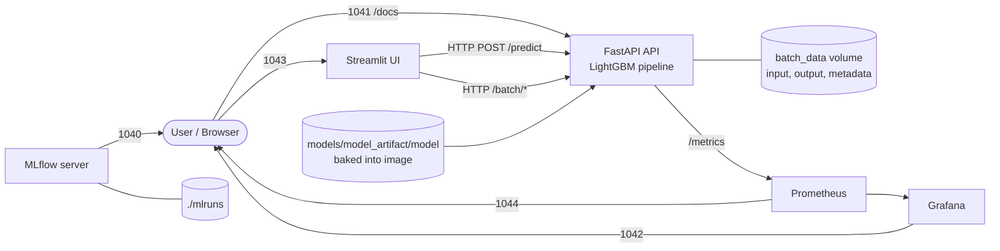
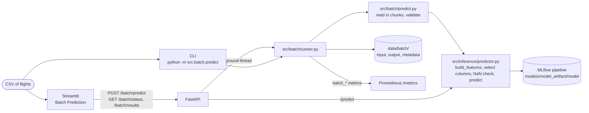

# ✈️ Flight Delay Prediction

An end-to-end machine-learning project that predicts a flight's **arrival delay (in minutes)** from information known before departure. It covers the full lifecycle: data cleaning, feature engineering, LightGBM training with MLflow tracking, a FastAPI inference service (online and batch), a Streamlit UI, Prometheus/Grafana monitoring, Docker Compose orchestration, and a GitHub Actions CI/CD pipeline.


---

## Table of Contents

1. [What this project does](#what-this-project-does)
2. [Architecture](#architecture)
3. [Project structure](#project-structure)
4. [Tech stack](#tech-stack)
5. [Machine-learning pipeline](#machine-learning-pipeline)
6. [Model results](#model-results)
7. [Getting started](#getting-started)
8. [Configuration](#configuration)
9. [API reference](#api-reference)
10. [Streamlit application](#streamlit-application)
11. [Batch Serving](#batch-serving)
12. [MLflow](#mlflow)
13. [Docker and Docker Compose](#docker-and-docker-compose)
14. [Monitoring: Prometheus and Grafana](#monitoring-prometheus-and-grafana)
15. [Testing](#testing)
16. [CI/CD](#cicd)
17. [Deployment](#deployment)
18. [Known limitations](#known-limitations)
19. [Documentation](#documentation)

---

## What this project does

- **Problem type:** supervised **regression**. The target is the continuous `ARR_DELAY` column (minutes). A negative value means the flight is predicted to arrive early. There is no delayed / not-delayed classification and no probability or confidence score.
- **Inputs (8 fields per flight):** flight date, scheduled departure time, scheduled arrival time, scheduled duration, distance, carrier, origin airport, destination airport.
- **Model:** a scikit-learn `Pipeline` (`preprocessor` → `model`) wrapping a `LightGBM` `LGBMRegressor`, tracked and stored with MLflow.
- **Online Serving:** FastAPI loads the pipeline once at startup and exposes `/predict`, `/health`, `/model` and Prometheus `/metrics`. Streamlit is a thin HTTP client on top of it.
- **Batch Serving:** score a whole CSV of flights with the same model and the same feature code, from a CLI, the `/batch/*` API endpoints, or the Streamlit **Batch Prediction** page. See [Batch Serving](#batch-serving).
- **No historical lookups:** the model uses only the fields in the request. It does not query previous flights or prior-delay statistics at inference time (`/model` reports `historical_features_used: false`).

---

## Architecture

### Runtime (Docker Compose)



### Training flow

```text
data/*.csv
  → load_data()                     concatenate all monthly CSVs
  → clean_data()                    filter cancelled/diverted/invalid rows, IQR outlier removal on ARR_DELAY
  → split_data()                    chronological 80/20 split by FL_DATE
  → build_features()                calendar, time, cyclical, route/carrier and distance features
  → ColumnTransformer               constant imputation (numeric) + sparse one-hot (categorical)
  → LGBMRegressor                   wrapped together with the preprocessor in one sklearn Pipeline
  → RMSE / MAE / R² (train + test)
  → MLflow                          params, metrics, feature_importance.csv, model
```

### Inference flow

```text
POST /predict (FlightRequest JSON)
  → Pydantic validation             unknown fields rejected (extra="forbid")
  → pandas DataFrame
  → build_features()                same code path as training
  → select the 29 columns the fitted preprocessor expects
  → NaN / missing-column checks
  → Pipeline.predict()
  → PredictionResponse              prediction rounded to 2 decimals
```

Training and serving share `build_features()`, and the API selects columns from the fitted preprocessor's `feature_names_in_`. This keeps the serving feature contract identical to training.

Steps 2-4 and the final predict call now live in `src/inference/predictor.py` and are shared with Batch Serving, which runs the same steps over a CSV in chunks (see [Batch Serving](#batch-serving)).

---

## Project structure

```text
flight_delay_prediction/
├── .github/
│   └── workflows/
│       ├── ci.yml                     Run pytest on push / PR to main and develop
│       ├── cd.yml                     Build and push Docker image to GHCR after CI succeeds on main
│       └── pytest.ini                 Copy of the root pytest config
├── app/
│   ├── app.py                         Streamlit client (calls the API over HTTP); sidebar navigation
│   ├── batch_page.py                  "Batch Prediction" page (upload, status polling, download)
│   └── batch_analysis.py              "Batch Analysis" section (filters, KPIs, charts, data table)
├── config/
│   └── config.py                      Central configuration (data, model, features, MLflow, API)
├── data/                              Monthly flight CSVs and data/batch/ (git-ignored, not in the repo)
├── docs/                              Detailed project documentation (see "Documentation")
├── mlruns/                            Local MLflow file store (experiment runs, metrics, params)
├── models/
│   └── model_artifact/model/          Bundled MLflow model served by the API
│       ├── MLmodel
│       ├── model.pkl                  Fitted sklearn Pipeline (cloudpickle)
│       ├── conda.yaml / python_env.yaml / requirements.txt
│       └── registered_model_meta
├── monitoring/
│   ├── prometheus/
│   │   └── prometheus.yml             Scrapes api:8000/metrics every 15s
│   └── grafana/
│       ├── dashboards/
│       │   └── flight_delay_dashboard.json
│       └── provisioning/
│           ├── datasources/prometheus.yml
│           └── dashboards/dashboards.yml
├── nginx/
│   └── flight-delay.duckdns.org.conf  Reverse-proxy site config for the VPS (not run by Compose)
├── notebook/
│   └── note1.ipynb                    Exploratory analysis
├── src/
│   ├── api/
│   │   ├── main.py                    FastAPI app, endpoints, Prometheus instrumentation
│   │   ├── batch_routes.py            /batch/predict, /batch/status/{id}, /batch/results/{id}
│   │   ├── model_loader.py            Loads and validates the MLflow pipeline; holds shared model state
│   │   └── schemas.py                 Pydantic request / response models
│   ├── batch/
│   │   ├── predict.py                 Validation, chunked prediction, output writing, and the CLI
│   │   ├── runner.py                  Runs a batch: status tracking, metrics, background execution
│   │   ├── analysis.py                Batch analysis: loading, filters, KPIs, aggregations (pandas, no Streamlit)
│   │   ├── charts.py                  Altair chart definitions for the analysis dashboard
│   │   ├── schemas.py                 Batch metadata / status models and column constants
│   │   ├── store.py                   JSON metadata store and data/batch paths
│   │   ├── metrics.py                 Prometheus batch metrics
│   │   └── errors.py                  User-safe batch errors
│   ├── data/
│   │   ├── load.py                    Load and concatenate monthly CSVs
│   │   ├── clean_data.py              Training-time filtering and outlier removal
│   │   └── split_data.py              Chronological train/test split
│   ├── features/
│   │   └── build_feature.py           Feature engineering (shared by training and API)
│   ├── inference/
│   │   └── predictor.py               Feature building + prediction shared by /predict and batch
│   ├── models/
│   │   └── train.py                   Training, evaluation and MLflow logging
│   └── preprocessing/
│       ├── preprocess.py              ColumnTransformer (imputer + one-hot encoder)
│       └── target_encoder.py          Out-of-fold target encoder (tested, not used in the active pipeline)
├── tests/
│   ├── load/
│   │   └── locustfile.py              Locust load-test scenarios
│   ├── conftest.py                    Shared batch fixtures (temp batch dirs, fake model)
│   ├── test_api.py                    API endpoint tests (with a fake model)
│   ├── test_batch_analysis.py         Analysis helpers: KPIs, categories, aggregations, filters, loading, chart payload size
│   ├── test_batch_analysis_page.py    Batch Analysis section rendered with Streamlit AppTest (filters, Top N, no raw rows sent)
│   ├── test_batch_api.py              /batch/* endpoint tests
│   ├── test_batch_page.py             Streamlit batch page helpers
│   ├── test_batch_predict.py          Batch validation, features, prediction, output, CLI
│   ├── test_batch_runner.py           Batch metadata store, job runner, metrics
│   ├── test_build_features.py         Feature-engineering tests
│   └── test_target_encoding.py        Preprocessor and target-encoder tests
├── .dockerignore
├── .gitignore
├── Dockerfile
├── docker-compose.yml
├── pytest.ini
├── requirements.txt
└── README.md
```

---

## Tech stack

| Area | Tools (pinned in `requirements.txt`) |
| --- | --- |
| Language | Python 3.11 (Docker image and CI) |
| ML | LightGBM 4.7.0, scikit-learn 1.9.0, pandas 2.3.3, NumPy 2.4.6, SciPy 1.17.1 |
| Experiment tracking | MLflow 3.15.1 |
| API | FastAPI 0.141.1, Uvicorn 0.52.4, Pydantic (via FastAPI), python-multipart 0.0.32 (CSV uploads) |
| UI | Streamlit 1.62.0 (includes Altair, used for the analysis charts), requests 2.34.2 |
| Metrics | prometheus-fastapi-instrumentator 8.1.0, prometheus-client 0.26.0 |
| Testing | pytest 9.1.1, httpx 0.28.1 (FastAPI `TestClient`), Locust (load tests, not in `requirements.txt`) |
| Infrastructure | Docker, Docker Compose, Prometheus, Grafana, Nginx (VPS config), GitHub Actions, GHCR |

---

## Machine-learning pipeline

### Data

`load_data()` reads and concatenates every `data/*.csv` (sorted by filename). The CSVs are not committed (`data/` and `*.csv` are git-ignored), so training requires you to supply your own files with this schema:

```text
YEAR, QUARTER, MONTH, FL_DATE, OP_UNIQUE_CARRIER, ORIGIN_AIRPORT_ID, ORIGIN,
DEST_AIRPORT_ID, DEST, CRS_DEP_TIME, CRS_ARR_TIME, ARR_DELAY, CANCELLED,
DIVERTED, CRS_ELAPSED_TIME, DISTANCE
```

Scheduled times are `HHMM` values (for example `0500` or `1430`).

### Cleaning (`src/data/clean_data.py`)

1. Require `CANCELLED`, `DIVERTED`, `CRS_ELAPSED_TIME` and `ARR_DELAY` columns.
2. Drop cancelled and diverted flights.
3. Drop rows with `CRS_ELAPSED_TIME <= 0`.
4. Drop rows with a missing `ARR_DELAY`.
5. Remove `ARR_DELAY` outliers outside the 1.5 × IQR bounds.

### Split (`src/data/split_data.py`)

Rows are sorted by `FL_DATE`. The earliest 80% are used for training and the latest 20% for testing, so the model is evaluated on later flights than it was trained on. The preprocessor is fitted on the training set only.

### Feature engineering (`src/features/build_feature.py`)

`build_features()` validates the raw columns, then derives the model input. The final model uses **29 features** (list defined in `config/config.py`):

| Group | Features |
| --- | --- |
| Raw numeric | `CRS_ELAPSED_TIME`, `DISTANCE` |
| Calendar | `year`, `month`, `quarter`, `day`, `day_of_week`, `week_of_year`, `is_weekend` |
| Scheduled time | `departure_hour`, `departure_minute`, `departure_time_minutes`, `arrival_hour`, `arrival_minute`, `arrival_time_minutes` |
| Cyclical (sin / cos) | `departure_hour`, `day_of_week`, `month` |
| Derived numeric | `distance_log` (`log1p(DISTANCE)`), `is_peak_departure` (hours 7–9 and 16–19) |
| Categorical | `OP_UNIQUE_CARRIER`, `ORIGIN`, `DEST`, `route` (`ORIGIN_DEST`), `carrier_origin` (`CARRIER_ORIGIN`), `departure_period` (night / morning / afternoon / evening) |

It raises `ValueError` on invalid dates, invalid `HHMM` times, negative distance, missing features, or NaN model inputs. The optional `history` argument is accepted for compatibility but no historical statistics are computed.

### Preprocessing (`src/preprocessing/preprocess.py`)

A `ColumnTransformer` with:

- **Numeric:** `SimpleImputer(strategy="constant", fill_value=0)`
- **Categorical:** `OneHotEncoder(handle_unknown="ignore", sparse_output=True)`, so unseen carriers or airports are ignored instead of raising errors.

### Model (`src/models/train.py`)

`LGBMRegressor` with the following hyperparameters:

```text
num_leaves=63, max_depth=-1, learning_rate=0.10, n_estimators=1000,
min_child_samples=200, reg_alpha=0.0, reg_lambda=1.0, colsample_bytree=1.0,
n_jobs=-1, random_state=42
```

The preprocessor and model are wrapped in one sklearn `Pipeline` with steps named `preprocessor` and `model`. The API validates these names at startup.

---

## Model results

Metrics come from the MLflow runs committed in `mlruns/` (experiment `flight_arr_delay_champion_model1`, chronological split, RMSE and MAE in minutes):

| Run | Train rows | Test rows | Test RMSE | Test R² |
| --- | ---: | ---: | ---: | ---: |
| `7dc7a612…` (**bundled model**) | 80,000 | 20,000 | 17.71 | 0.037 |
| `3f939f23…` | 800,000 | 200,000 | 18.24 | 0.035 |
| `6ecc72ac…` (largest) | 4,000,000 | 1,000,000 | 16.96 | 0.059 |

The model bundled in `models/model_artifact/model` comes from run `7dc7a612afa34edd92e44cc98a63bf8e` (test MAE 13.47, train R² 0.46). Test R² is low in every run: arrival delay is hard to predict from schedule-only features, and the model shows a large train/test gap. Treat this project as a complete, working ML system rather than a highly accurate delay predictor.

---

## Getting started

### Prerequisites

- Python 3.11 (the Docker image and CI use 3.11)
- Docker and Docker Compose (only for the containerized setup)
- The bundled model at `models/model_artifact/model` (already in the repo). The data CSVs are only needed for training.

### Option A: Run everything with Docker Compose

```bash
docker compose up --build
```

| Service | URL |
| --- | --- |
| Streamlit UI | http://localhost:1043 |
| FastAPI (Swagger UI) | http://localhost:1041/docs |
| Prometheus | http://localhost:1044 |
| Grafana | http://localhost:1042 |
| MLflow UI | http://localhost:1040 |

Stop with `docker compose down`.

### Option B: Run locally without Docker

```bash
python -m venv .venv
source .venv/bin/activate            # Windows PowerShell: .\.venv\Scripts\Activate.ps1
pip install -r requirements.txt

# Point the API at the bundled model (the code default is the Docker path /app/model_artifact)
export MLFLOW_MODEL_URI=models/model_artifact/model
uvicorn src.api.main:app --host 127.0.0.1 --port 8000
```

In a second terminal, start the UI. `API_URL` must be set because the code default targets the Compose port (`http://127.0.0.1:1041`):

```bash
source .venv/bin/activate
export API_URL=http://127.0.0.1:8000
streamlit run app/app.py
```

Open http://127.0.0.1:8501 for Streamlit and http://127.0.0.1:8000/docs for the API. You can put these variables in a `.env` file instead of exporting them; `python-dotenv` loads it automatically.

Quick check of the model loader:

```bash
python -m src.api.model_loader
```

### Train a model

Training needs the monthly CSVs in `data/` and an MLflow tracking server. `train.py` sets the tracking URI when it is imported. The default is `http://127.0.0.1:1040`, which is where the Compose `mlflow` service listens:

```bash
docker compose up -d mlflow
python -m src.models.train                      # all rows in data/*.csv
python -m src.models.train --sample-size 100000  # quick experiment (earliest N cleaned rows)
```

To use a different tracking server, set `MLFLOW_TRACKING_URI`. Training logs the run to MLflow. To serve the new model, point `MLFLOW_MODEL_URI` at its artifact directory (or replace `models/model_artifact/model`, which is what the Docker image copies).

---

## Configuration

All settings live in `config/config.py` and are read from environment variables (`.env` is loaded with `python-dotenv`).

| Variable | Default in code | Used by | Purpose |
| --- | --- | --- | --- |
| `MLFLOW_MODEL_URI` | `/app/model_artifact` | API | Path or URI of the MLflow model to serve |
| `MLFLOW_TRACKING_URI` | `http://127.0.0.1:1040` | Training | MLflow tracking server |
| `MLFLOW_EXPERIMENT_NAME` | `flight_arr_delay_champion_model1` | Training | MLflow experiment |
| `API_URL` | `http://127.0.0.1:1041` | Streamlit | Base URL of the FastAPI service |
| `API_HOST` / `API_PORT` | `0.0.0.0` / `8000` | Docker `CMD` | Uvicorn bind address (set as image `ENV`) |
| `TRAINING_YEAR` | `2025` | Config only | Defined but not used by the training flow |
| `BATCH_DATA_DIR` | `data/batch` | API, CLI | Batch input / output / metadata root (see [Batch configuration](#batch-configuration)) |
| `BATCH_CHUNK_SIZE` / `BATCH_MAX_UPLOAD_MB` / `BATCH_MAX_WORKERS` | `100000` / `200` / `1` | API, CLI | Batch chunk size, upload limit, background workers |

`.env` is git-ignored and excluded from the Docker image. Do not commit secrets.

---

## API reference

Entry point: `src.api.main:app` (title "Flight Arrival Delay Prediction API", version `1.0.0`). The model is loaded once during application startup; if it cannot be loaded or validated, the app fails to start.

| Method | Endpoint | Description |
| --- | --- | --- |
| `GET` | `/` | Service name, version and endpoint list |
| `GET` | `/health` | `{"status": "healthy", "model_loaded": true, "model_type": "Pipeline"}` (or `unhealthy` when no model is loaded) |
| `GET` | `/model` | Model URI, pipeline steps, model / preprocessor type, expected columns, `historical_features_used`. Returns 503 if no model is loaded |
| `POST` | `/predict` | Predict arrival delay for one flight |
| `POST` | `/batch/predict` | Upload a CSV and start a batch job (see [Batch Serving](#batch-serving)) |
| `GET` | `/batch/status/{batch_id}` | Batch status and progress |
| `GET` | `/batch/results/{batch_id}` | Download the predictions CSV |
| `GET` | `/metrics` | Prometheus metrics (including `batch_*`) |
| `GET` | `/docs` | Interactive Swagger UI |

### `POST /predict`

Request body (all fields required, unknown fields such as `ARR_DELAY` are rejected with 422):

```json
{
  "FL_DATE": "2026-08-22",
  "CRS_DEP_TIME": 800,
  "CRS_ARR_TIME": 1100,
  "CRS_ELAPSED_TIME": 180,
  "DISTANCE": 2475,
  "OP_UNIQUE_CARRIER": "AA",
  "ORIGIN": "JFK",
  "DEST": "LAX"
}
```

```bash
curl -X POST http://localhost:1041/predict \
  -H "Content-Type: application/json" \
  -d '{"FL_DATE":"2026-08-22","CRS_DEP_TIME":800,"CRS_ARR_TIME":1100,"CRS_ELAPSED_TIME":180,"DISTANCE":2475,"OP_UNIQUE_CARRIER":"AA","ORIGIN":"JFK","DEST":"LAX"}'
```

Response:

```json
{
  "prediction": 21.24,
  "target": "ARR_DELAY",
  "model": "lightgbm",
  "source": "mlflow"
}
```

The exact `prediction` value depends on the loaded model. Use port `8000` if you run the API locally (Option B).

| Status | Cause |
| --- | --- |
| `200` | Success |
| `400` | Feature validation failed (for example an invalid `HHMM` time or negative distance) |
| `422` | Request schema violation (missing field, wrong type, unknown field) |
| `500` | Model input missing columns or containing NaN, or an unexpected inference error |
| `503` | Model not loaded |

---

## Streamlit application

`app/app.py` is a **thin client**: it never loads the model or runs feature engineering. It:

- collects carrier, origin, destination, flight date, departure and arrival times, distance and scheduled duration;
- validates basic inputs client-side (positive distance and duration, origin ≠ destination);
- sends the request to `POST /predict` and shows the predicted delay in minutes;
- shows API status in the sidebar (`/health`) and the model's numerical/categorical features in an expander (`/model`), both cached for 15 seconds;
- maps API failures (connection errors, timeouts, 4xx/5xx) to readable messages.

A sidebar **Navigation** switch selects between **Single Prediction** (the form above) and **Batch Prediction** (`app/batch_page.py`), which uploads a CSV to the batch API and shows progress and a download button. See [Batch Serving](#batch-serving).

The carrier and airport dropdowns are fixed lists of common IATA codes. The API itself accepts any string and ignores unseen categories at the one-hot step.

---

## Batch Serving

Batch Serving scores a whole CSV of flights in one job. It is an addition to Online Serving, not a replacement: `/predict` behaves exactly as before.

| | Online Serving | Batch Serving |
| --- | --- | --- |
| Entry point | `POST /predict` (one flight, JSON) | CLI, `POST /batch/predict`, or the Streamlit **Batch Prediction** page (many flights, CSV) |
| Response | Immediate | Background job: submit, poll, download |
| Model | The MLflow pipeline in `MLFLOW_MODEL_URI` | **The same pipeline** (same artifact, same loader) |
| Features | `build_features()` | **The same `build_features()`** |

### Batch architecture



Online and batch share one code path, `src/inference/predictor.py`:

```text
prepare_model_input(raw_rows, expected_columns)
  → build_features()                       same feature engineering as training and /predict
  → select the 29 columns the fitted preprocessor expects
  → NaN / missing-column checks
predict_frame(model, X)                    one model.predict() call per frame
```

`POST /predict` was refactored to call these two functions (its responses and error bodies are unchanged). Batch adds only what a file needs on top: CSV reading in chunks, vectorised type validation (the batch equivalent of `FlightRequest`), and writing the output. There is no second preprocessing pipeline and no second model artifact. `tests/test_batch_predict.py` checks that batch predictions equal `POST /predict` predictions for the same flights, using the real bundled model.

How a batch runs:

1. The file is validated cheaply (exists, `.csv`, not empty, has all required columns) before the model is touched.
2. The rows are counted, then the model is loaded (the API reuses the model it already holds).
3. The CSV is processed in chunks of `BATCH_CHUNK_SIZE` rows (default 100,000): each chunk is validated, featurised, and predicted with a single vectorised `model.predict()` call. Memory stays bounded, so multi-million-row files work (2.27 M rows took about 2 minutes and about 560 MB of RAM in a local run).
4. Output is written to a temporary file and moved into place only when the whole batch succeeds, so a failed batch never leaves a partial CSV.

### Input format

A CSV with a header row, UTF-8 encoded. These 8 columns are **required** (the same fields as `POST /predict`):

| Column | Meaning | Example |
| --- | --- | --- |
| `FL_DATE` | Flight date (any format pandas can parse) | `2026-09-01` or `9/1/2026 12:00:00 AM` |
| `CRS_DEP_TIME` | Scheduled departure, `HHMM`, whole number | `0800` |
| `CRS_ARR_TIME` | Scheduled arrival, `HHMM`, whole number | `1100` |
| `CRS_ELAPSED_TIME` | Scheduled duration in minutes | `180` |
| `DISTANCE` | Distance in miles, not negative | `2475` |
| `OP_UNIQUE_CARRIER` | Carrier code | `AA` |
| `ORIGIN` | Origin airport code | `JFK` |
| `DEST` | Destination airport code | `LAX` |

Any other columns (for example the raw `month_*.csv` columns such as `ARR_DELAY`) are allowed, ignored by the model, and copied to the output unchanged. The input must not already contain a `predicted_arr_delay` column. If any value is invalid the batch fails and the error names the column and the file rows (row 1 is the header). Unlike the training pipeline, batch does not silently drop bad rows.

### Output format

The input, column for column and value for value (text such as `0800` keeps its leading zero), plus one new column, `predicted_arr_delay`: the predicted arrival delay in minutes, rounded to 2 decimals like `/predict`. Row order is preserved.

```text
FL_DATE,OP_UNIQUE_CARRIER,ORIGIN,DEST,CRS_DEP_TIME,CRS_ARR_TIME,CRS_ELAPSED_TIME,DISTANCE,predicted_arr_delay
2026-09-01,AA,JFK,LAX,0800,1100,180,2475,12.4
2026-09-01,DL,ATL,JFK,0930,1150,140,760,8.7
```

### CLI usage

The CLI uses the same model settings as the API. Run it locally with `MLFLOW_MODEL_URI` pointing at the model (see [Option B](#option-b-run-locally-without-docker)):

```bash
export MLFLOW_MODEL_URI=models/model_artifact/model

python -m src.batch.predict \
    --input data/batch/input/september_2026.csv \
    --output data/batch/output/september_2026_predictions.csv \
    --batch-id september-2026
```

| Option | Description |
| --- | --- |
| `--input` | Input CSV (required) |
| `--output` | Output CSV. Default: `data/batch/output/<batch_id>_predictions.csv` |
| `--batch-id` | Batch id (1-64 letters, digits, `.`, `_`, `-`). Default: generated, e.g. `batch-20260922-001` (numbered per UTC day). Ids are unique; reusing one is an error |

Progress is logged and the exit code reports the result: `0` completed, `1` the batch failed (the reason is printed), `2` invalid arguments (bad or duplicate batch id, input equals output).

```text
Batch started: september-2026
Input: /.../september_2026.csv
Rows: 120000
Model loaded
Processed 100,000 rows (features built, predicted)
Processed 120,000 rows (features built, predicted)
Prediction completed: 120000 rows
Predictions saved: /.../september_2026_predictions.csv
Duration: 18.4s
```

### Batch API endpoints

| Method | Endpoint | Description |
| --- | --- | --- |
| `POST` | `/batch/predict` | Upload a CSV (`multipart/form-data`, field `file`). Returns `202` with a `batch_id`; processing continues in the background |
| `GET` | `/batch/status/{batch_id}` | Current status and progress |
| `GET` | `/batch/results/{batch_id}` | Download the predictions CSV (only when the batch is `completed`) |

```bash
curl -F "file=@flights.csv;type=text/csv" http://localhost:1041/batch/predict
# {"batch_id":"batch-20260922-001","status":"pending"}

curl http://localhost:1041/batch/status/batch-20260922-001
# {"batch_id":"batch-20260922-001","status":"completed","input_filename":"flights.csv",
#  "output_file":"batch-20260922-001_predictions.csv","rows":120000,"rows_processed":120000,
#  "prediction_column":"predicted_arr_delay","started_at":"...","completed_at":"...",
#  "duration_seconds":18.4,"model_version":"m-593d1139fa5c42c7bfef5f1815bc1717","error":null}

curl -o predictions.csv http://localhost:1041/batch/results/batch-20260922-001
```

`status` is one of `pending`, `running`, `completed`, `failed`. When a batch fails, `status` is `failed` and `error` holds a readable reason such as `Missing required columns: DEST, ORIGIN`.

| Status | Cause |
| --- | --- |
| `202` | Batch accepted |
| `400` | Upload rejected before a batch was created (not `.csv`, empty, invalid CSV, missing columns, ...). Body: `{"status": "failed", "error": "..."}` |
| `404` | Unknown or malformed `batch_id` |
| `409` | `/batch/results` called before the batch is `completed` (or after it failed) |
| `413` | Upload larger than `BATCH_MAX_UPLOAD_MB` (default 200) |
| `422` | No `file` field in the request |

Security: only `.csv` uploads are accepted and are never executed; batch ids are generated by the server (or validated against a strict pattern on the CLI); uploaded file names are used only as a display label, never as a path; the results endpoint only serves files inside the batch output directory; API responses contain no server paths; and error messages never include stack traces (those are logged server-side).

Batches started through the API run on a background thread pool with `BATCH_MAX_WORKERS` workers (default 1), so `/predict` stays responsive and extra batches wait as `pending`. If the API restarts while a batch is queued or running, that batch is marked `failed` on the next startup.

### Dashboard usage

Open the Streamlit UI (http://localhost:1043) and choose **Batch Prediction** in the sidebar navigation.

1. Upload a CSV. The page shows the file name and row count and checks the required columns (with a preview of the first rows).
2. Click **Run Batch Prediction**. The batch id and status (`PENDING`, `RUNNING`, `COMPLETED`, `FAILED`) appear, with a progress bar that updates every 2 seconds.
3. When the batch completes, the page shows rows processed and duration, and a **Download Predictions** button.
4. If it fails, the reason is shown. No stack traces reach the UI.
5. A completed batch also opens the **Batch Analysis** section described [below](#batch-analysis-dashboard).

Like the single-prediction page, this is a thin client: the file is uploaded to FastAPI and the result is downloaded through FastAPI, so Streamlit needs no access to the API's files.

### Batch Analysis dashboard

When a batch completes, the **Batch Prediction** page adds a **Batch Analysis** section under the download button. It reads the predictions CSV the dashboard has already fetched for that download (nothing is predicted again, and the downloaded file is never modified) and turns it into interactive charts, so you can inspect the result without opening the CSV.

1. **Upload batch data** and click **Run Batch Prediction**, as above.
2. **Inspect the KPIs:** total flights, average, median, maximum and minimum predicted delay, and the share of flights predicted to be delayed by more than 15 minutes (`predicted_arr_delay` is the only prediction field used).
3. **Narrow the data with Analysis Filters:** carrier, origin, destination and date range (an empty selection means "All"). Every KPI and chart follows the filters; a caption shows how many flights match. A **minimum flights** setting hides groups with too few flights, so a single delayed flight cannot top a ranking.
4. **Analyze the delay distribution:** a histogram of predicted arrival delay with a reference line at 15 minutes.
5. **Analyze carriers:** average predicted delay per `OP_UNIQUE_CARRIER`, sorted, with each carrier's flight count.
6. **Analyze airports:** average predicted delay per `ORIGIN` and per `DEST`, each with a Top N selector (5, 10, 15 or 20).
7. **Analyze routes:** average predicted delay per `ORIGIN → DEST` route, with Top N (default 10).
8. **Analyze time trends:** average predicted delay and number of flights per day (only when `FL_DATE` is present and valid).
9. **See the delay categories:** On Time (≤ 0 min), Minor (> 0 and ≤ 15), Moderate (> 15 and ≤ 30) and Severe (> 30), as a chart plus a count and percentage table. The thresholds live in one place, `DELAY_CATEGORIES` in `src/batch/analysis.py`.
10. **Browse the rows** in **View Prediction Data** (a column picker with a sensible default subset; the first 1,000 matching rows) and **download the exact predictions CSV** with the existing **Download Predictions** button.

Charts are interactive: hover for values, drag or scroll to zoom and pan, and click the delay-category legend to highlight a category. Sections that need a column the file lacks (for example `FL_DATE` or `OP_UNIQUE_CARRIER`) show a short "unavailable because ... is not present" message instead of failing, and a missing, empty or unreadable predictions file shows an error message rather than a crash.

**Built for large batches.** The CSV is parsed once per batch, keeping only the columns the analysis needs (text columns as categoricals), and every chart is fed pre-aggregated data: 50 histogram bins, the top N groups, one row per day, four categories. Raw rows are never sent to the browser. Results are cached per batch and filter selection, so changing a Top N selector recomputes nothing. In local runs, a 2.27 M-row predictions file loaded in about 3 seconds (93 MB in memory) and all seven charts together were about 31 KB; through the Docker stack, a 1.4 M-row upload was analysed 7 seconds after the batch finished, changing a filter refreshed the page in under a second, and the browser received about 230 KB in total.

Charts use [Altair](https://altair-viz.github.io/), which ships with Streamlit, so there is no extra dependency. The code is split into `src/batch/analysis.py` (pandas logic: loading, filters, KPIs, aggregations), `src/batch/charts.py` (chart definitions) and `app/batch_analysis.py` (Streamlit layout and caching).

Limits: the analysis holds the predictions file and its parsed frame in the Streamlit process (roughly 250 MB for a 1.4 M-row batch), so very large batches use correspondingly more memory in the `streamlit` container.

### Batch data and metadata

```text
data/batch/
├── input/      <batch_id>.csv               uploaded files
├── output/     <batch_id>_predictions.csv   generated predictions
└── metadata/   <batch_id>.json              one record per batch
```

The whole `data/` directory is git-ignored (and `data/batch/` is listed explicitly), so no batch data is committed. The directories are created on demand. Metadata is a small JSON file per batch, written atomically; there is no database:

```json
{
  "batch_id": "september-2026",
  "status": "completed",
  "source": "cli",
  "input_file": "/.../september_2026.csv",
  "input_filename": "september_2026.csv",
  "output_file": "/.../september_2026_predictions.csv",
  "rows": 120000,
  "rows_processed": 120000,
  "prediction_column": "predicted_arr_delay",
  "created_at": "2026-09-22T10:00:00+00:00",
  "started_at": "2026-09-22T10:00:00+00:00",
  "completed_at": "2026-09-22T10:00:18+00:00",
  "duration_seconds": 18.4,
  "model_uri": "/app/model_artifact",
  "model_version": "m-593d1139fa5c42c7bfef5f1815bc1717",
  "error": null
}
```

`model_version` is the model id recorded in the artifact's `MLmodel` file. Timestamps are UTC.

### Batch with Docker

Batch runs inside the existing `api` container; there is no extra service. Compose mounts a named volume, `batch_data`, at `/app/data/batch`, so uploads, outputs and metadata survive rebuilds. The bundled model is already in the image.

```bash
docker compose up -d --build

# Use the dashboard (http://localhost:1043) or the API (http://localhost:1041), or run the CLI in the container:
docker compose cp flights.csv api:/app/data/batch/input/flights.csv
docker compose exec api python -m src.batch.predict \
    --input /app/data/batch/input/flights.csv \
    --output /app/data/batch/output/flights_predictions.csv
docker compose cp api:/app/data/batch/output/flights_predictions.csv .
```

Batches run through the API are also downloadable from `GET /batch/results/{batch_id}`. Batches run with the CLI are visible through `/batch/status/{id}` and downloadable through `/batch/results/{id}` when their output is in `data/batch/output/`.

### Batch monitoring

Batch jobs run by the API export these metrics on the existing `/metrics` endpoint, which Prometheus already scrapes (no Prometheus change needed):

| Metric | Type | Meaning |
| --- | --- | --- |
| `batch_jobs_total` | counter | Batch jobs started |
| `batch_jobs_success_total` | counter | Jobs completed |
| `batch_jobs_failed_total` | counter | Jobs failed |
| `batch_rows_processed_total` | counter | Rows predicted |
| `batch_duration_seconds` | histogram | Job duration |

Jobs run with the standalone CLI live in a short-lived process, so they are not scraped; use their metadata file instead. The provisioned Grafana dashboard has no batch panels yet, but the metrics can be queried in Prometheus and Grafana Explore.

### Batch configuration

| Variable | Default | Purpose |
| --- | --- | --- |
| `BATCH_DATA_DIR` | `<project>/data/batch` (`/app/data/batch` in Docker) | Root of the `input/`, `output/`, `metadata/` directories |
| `BATCH_CHUNK_SIZE` | `100000` | Rows per processing chunk |
| `BATCH_MAX_UPLOAD_MB` | `200` | Maximum upload size for `POST /batch/predict` |
| `BATCH_MAX_WORKERS` | `1` | Concurrent background batch jobs in the API |

### Batch limitations

- **All-or-nothing validation:** one invalid row (for example an empty `CRS_ELAPSED_TIME`, which does occur in the raw monthly files) fails the whole batch. Clean or filter the file first.
- **No cleanup:** input, output and metadata files are kept until deleted; there is no retention policy yet.
- **Analysis memory:** the Batch Analysis section works on the predictions file inside the Streamlit process (see [Batch Analysis dashboard](#batch-analysis-dashboard)), and only for batches that complete through the dashboard.
- **Single API process:** job state lives on disk but jobs run in the API process, so they do not survive a restart and cannot be spread across several API workers or containers. A queue such as Celery or RQ would be the next step for that.
- **No authentication** on the batch endpoints (same as the rest of the API), and any client can read any batch by id. Do not expose the stack publicly without adding access control.
- **Reverse proxy limits:** the bundled Nginx site config only proxies Streamlit. If you proxy FastAPI directly, raise `client_max_body_size` for large uploads.

---

## MLflow

- `train.py` logs, for each run: the LightGBM hyperparameters, row counts (`train_rows`, `test_rows`), `num_features`, `train_*` / `test_*` metrics (RMSE, MAE, R²), a `feature_importance.csv` artifact, and the full sklearn pipeline (`mlflow.sklearn.log_model`, cloudpickle serialization).
- Runs are stored in the local `mlruns/` file store under the experiment `flight_arr_delay_champion_model1`.
- The Compose `mlflow` service serves that store (`./mlruns` mounted at `/mlruns`) on host port `1040`.
- The API loads a model **directly from a local path** (`MLFLOW_MODEL_URI`) with `mlflow.sklearn.load_model()`. It does not use a model registry or stage/alias promotion.
- The bundled model records MLflow 3.15.1 and scikit-learn 1.9.0 in `MLmodel`. It was serialized under Python 3.14.7, while the Docker image uses Python 3.11, and it loads in both.

---

## Docker and Docker Compose

### Dockerfile

- Base image `python:3.11-slim`, plus `libgomp1` (required by LightGBM).
- Installs `requirements.txt`, then copies `config/`, `src/`, `app/` and `models/model_artifact/model` (as `/app/model_artifact`), and creates the empty `/app/data/batch/{input,output,metadata}` directories.
- Sets `MLFLOW_MODEL_URI=/app/model_artifact`, `API_HOST=0.0.0.0`, `API_PORT=8000`. The default command starts Uvicorn. Streamlit reuses the same image with a different command.
- `.dockerignore` keeps `.env`, `data/`, `mlruns/`, `tests/`, notebooks, CSVs and the virtualenv out of the image.

```bash
docker build -t flight-delay-prediction .
docker run --rm -p 8000:8000 flight-delay-prediction
```

### Compose services

| Service | Image | Host → container port | Notes |
| --- | --- | --- | --- |
| `api` | built from `Dockerfile` | `1041 → 8000` | Healthcheck calls `/health` every 10s (5s timeout, 5 retries, 15s start period). Mounts the `batch_data` volume at `/app/data/batch` for Batch Serving |
| `streamlit` | same image | `1043 → 1040` | Runs headless; `API_URL=http://api:8000`; waits for a healthy `api` |
| `mlflow` | `ghcr.io/mlflow/mlflow:latest` | `1040 → 5000` | File backend store at `./mlruns` |
| `prometheus` | `prom/prometheus:latest` | `1044 → 9090` | Mounts `monitoring/prometheus/prometheus.yml`; waits for a healthy `api` |
| `grafana` | `grafana/grafana:latest` | `1042 → 3000` | Provisioned datasource and dashboard; data in the `grafana_data` volume |

All services use `restart: unless-stopped`. The image name can be overridden with `IMAGE_NAME` (default `flight-delay-prediction:latest`).

---

## Monitoring: Prometheus and Grafana

- **Instrumentation:** `prometheus-fastapi-instrumentator` adds request metrics to the API and exposes them at `/metrics`.
- **Prometheus:** scrapes `api:8000/metrics` every 15 seconds (job `flight-delay-api`).
- **Grafana:** the Prometheus datasource (`http://prometheus:9090`) and the **Flight Delay - MLOps Monitoring** dashboard (uid `flight-delay-mlops`, refresh 15s) are provisioned from files, so no manual setup is needed.
- **Dashboard panels:** API status, requests/second, P95 latency, error rate (4xx/5xx), memory, CPU, requests over time, requests by endpoint, requests by status, and P95 latency over time.

Grafana runs with its image defaults (the Compose file does not set admin credentials). Change the default login before exposing it publicly.

Batch jobs add `batch_jobs_total`, `batch_jobs_success_total`, `batch_jobs_failed_total`, `batch_rows_processed_total` and `batch_duration_seconds` to the same `/metrics` endpoint (see [Batch monitoring](#batch-monitoring)).

The monitoring covers **API health, traffic and batch job counts only**. There is no model-quality or data-drift monitoring.

---

## Testing

```bash
pytest
```

`pytest.ini` sets `pythonpath = .` and `testpaths = tests`. The suite has **165 tests** (all passing). `tests/conftest.py` redirects the batch directories to a temp folder for every test, so tests never touch `data/batch/`:

| File | Covers |
| --- | --- |
| `tests/test_api.py` | `/health`, `/predict` (valid input, missing field, rejection of `ARR_DELAY`), `/model`, and the absence of historical features. Uses a fake pipeline, so no real model is needed |
| `tests/test_build_features.py` | `build_features()` works without history, produces every configured feature, and contains no historical columns |
| `tests/test_batch_predict.py` | Batch input validation, batch features equal online features, single vectorised predict per chunk, chunked output equals single-pass output, output generation and column preservation, failure handling, the CLI, and (with the real bundled model) batch predictions equal `POST /predict` |
| `tests/test_batch_runner.py` | Batch metadata store (unique / safe ids, updates, restart recovery), job runner status transitions and Prometheus counters, sanitised failures, background execution |
| `tests/test_batch_api.py` | `POST /batch/predict`, `/batch/status`, `/batch/results`: full flow, upload rejections, path-leak and traversal checks, failed jobs, startup recovery, `/metrics` |
| `tests/test_batch_page.py` | Streamlit batch page helpers |
| `tests/test_batch_analysis.py` | Analysis helpers on a small hand-checked fixture: KPIs, delay categories and their boundaries, carrier / origin / destination / route / daily aggregation, filtering, loading and validating the predictions CSV (missing file, empty, missing column, invalid values and dates), chart interactivity, and that charts embed only aggregated rows (200,000-row synthetic frame) |
| `tests/test_batch_analysis_page.py` | The Batch Analysis section rendered with Streamlit's `AppTest`: KPIs, all seven charts, carrier / origin / date filters, Top N, minimum flights, per-batch filter state, graceful messages for missing columns, and the exact number of rows Streamlit sends to the browser |
| `tests/test_target_encoding.py` | The preprocessor uses `OneHotEncoder(handle_unknown="ignore")`; the out-of-fold target encoder differs from a full-data fit |

### Load testing

`tests/load/locustfile.py` defines a Locust user that sends mostly valid `/predict` requests (about 97%), some invalid ones, and occasional `/health` calls. Locust is not in `requirements.txt`:

```bash
pip install locust
locust -f tests/load/locustfile.py --host http://localhost:1041
```

---

## CI/CD

| Workflow | Trigger | What it does |
| --- | --- | --- |
| `ci.yml` | Push or PR to `main` / `develop` | Python 3.11, `pip install -r requirements.txt`, `python -m pytest -v` |
| `cd.yml` | CI completes successfully on `main` | Logs in to GHCR, builds the image, pushes `ghcr.io/ahmed77923/flight-delay-prediction` tagged with the commit SHA and `latest` |

There is no linting or coverage step, and the CD workflow does not deploy to a server. It stops at publishing the image.

---

## Deployment

The project is set up for a single-VPS Docker Compose deployment:

- `docker compose up -d --build` runs the whole stack on the host.
- `nginx/flight-delay.duckdns.org.conf` is a site config for an **existing system-level Nginx** on the VPS. It is not run by Compose. It listens on port 80 for `flight-delay.duckdns.org` and proxies to Streamlit on `127.0.0.1:1043`, with the WebSocket upgrade headers and long timeouts that Streamlit needs. A commented-out `/api/` location can expose FastAPI under the same domain. The FastAPI service stays reachable directly on port `1041`.
- The Nginx config only serves HTTP. There is no TLS configuration in this repository.

---

## Known limitations

- **Modest accuracy:** see [Model results](#model-results). Test R² is between roughly 0 and 0.06 across the committed runs.
- **Schedule-only features:** no weather, airport congestion, aircraft rotation or previous-flight delay information is used.
- **Training data is not included** in the repository.
- **Tracking URI is hard-coded in the model loader:** `src/api/model_loader.py` calls `mlflow.set_tracking_uri("http://127.0.0.1:1040")`. This is harmless when loading from a local path, but it ignores `MLFLOW_TRACKING_URI`.
- **No authentication or TLS** on the API, Streamlit, MLflow or Prometheus, and Streamlit's XSRF protection is disabled in Compose. Do not expose the stack publicly without adding these controls.
- **No model registry workflow, automated retraining, or drift monitoring.**
- **Container-only paths:** the default `MLFLOW_MODEL_URI` and `API_URL` values in code suit the Docker/Compose setup, so local runs need the environment variables listed in [Getting started](#getting-started).

---

## Documentation

The `docs/` folder contains detailed per-topic documentation (architecture, data, feature engineering, modeling, training, MLflow, API, Streamlit, Docker, monitoring, testing, CI/CD, deployment, configuration, troubleshooting, security and a development guide). Start at [`docs/README.md`](docs/README.md). This README reflects the repository as inspected and is the reference for host port numbers if the docs differ.
