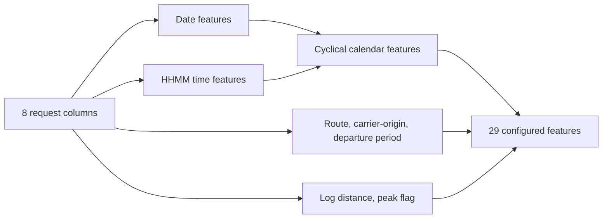

# Feature Engineering

## Purpose

The same feature builder is used by training code and the API so the fitted pipeline receives the expected feature names.

## Architecture / Concept

## Implementation

Required raw inputs are `FL_DATE`, `CRS_DEP_TIME`, `CRS_ARR_TIME`, `CRS_ELAPSED_TIME`, `DISTANCE`, `OP_UNIQUE_CARRIER`, `ORIGIN`, and `DEST`.

Derived features:

- Calendar: `year`, `month`, `quarter`, `day`, `day_of_week`, `week_of_year`, `is_weekend`.
- Schedule: departure/arrival hour and minute, and total minutes from midnight.
- Cyclical: sine/cosine pairs for departure hour, day of week, and month.
- Categories: `route`, `carrier_origin`, and binned `departure_period`.
- Numeric: `distance_log = log1p(DISTANCE)` and `is_peak_departure` for 07:00-09:59 or 16:00-19:59.

`build_features` validates dates, HHMM values, non-negative distance, required output columns, and NaN-free model features. Its optional `history` argument currently does not calculate historical delay features. Tests confirm that historical feature names are absent.

## Preprocessing

The 6 categorical features are one-hot encoded with `handle_unknown="ignore"` and sparse output. The 23 numerical features use constant-zero imputation. The `ColumnTransformer` drops all other columns. The active pipeline therefore has 29 preprocessor input columns before one-hot expansion.

## Limitations

Feature selection and schema versioning are manual. The custom `TargetEncoder` exists and is tested, but it is not part of the active `build_preprocessor` pipeline.
