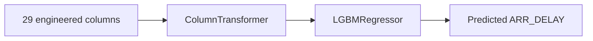

# Modeling

## Purpose

The active model predicts continuous arrival delay with a fitted preprocessing-and-regression pipeline.

## Architecture / Concept



## Implementation

The active algorithm is `lightgbm.LGBMRegressor` with:

```text
num_leaves=63
max_depth=-1
learning_rate=0.10
n_estimators=1000
min_child_samples=200
reg_alpha=0.0
reg_lambda=1.0
colsample_bytree=1.0
n_jobs=-1
random_state=42
verbosity=-1
```

The sklearn pipeline has two steps: `preprocessor` and `model`. The preprocessor uses numerical constant imputation and categorical sparse one-hot encoding. Unknown categorical values are ignored by the encoder rather than causing an inference error.

The target is `ARR_DELAY`. The API response rounds the prediction to two decimal places and identifies the model as `lightgbm` and source as `mlflow`.

## Serialization

The committed MLflow artifact uses skops serialization in `model.skops`, with MLflow sklearn flavor metadata. The API loads the complete pipeline, not a separately reconstructed preprocessor and estimator.

## Limitations

No confidence interval, probability, classification label, drift detector, or model comparison result is served by the API. No current metric values are committed in the artifact metadata.
