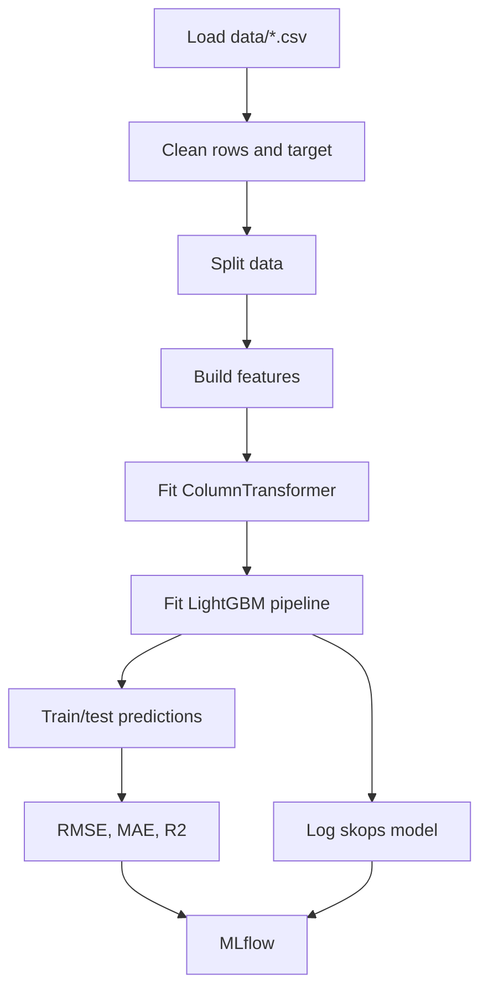

# Training

## Purpose

`src/models/train.py` contains the intended reproducible training workflow and MLflow logging path.

## Architecture / Concept



## Implementation

The trainer performs these steps:

1. Load CSV files from `Config.DATA.DATA_PATH`.
2. Clean cancelled, diverted, invalid-duration, missing-target, and outlier rows.
3. Call the missing `src.data.split_data.split_data` function.
4. Build train and test features.
5. Separate 29 model features from `ARR_DELAY`.
6. Fit a fresh `ColumnTransformer` and LightGBM pipeline.
7. Calculate train and test RMSE, MAE, and R2.
8. Log parameters, metrics, `feature_importance.csv`, and the sklearn model to MLflow.

The CLI accepts `--sample-size` and the alias `--sample_size`.

```bash
python -m src.models.train --sample-size 100000
```

## Reproducibility

The LightGBM model uses `random_state=42`; the configured model random state is also 42. The data split implementation is absent, and no data snapshot or preprocessing version is committed, so end-to-end reproduction is not currently guaranteed.

## Current blocker

Training from the current checkout is not currently runnable because `src/models/train.py` imports `src.data.split_data`, but that file is not present, and the expected `data/` directory is absent. Restore the split module and provide the CSV inputs before using the command above.

## Artifacts

The existing model artifact was trained earlier and is served independently of rerunning training. New artifacts require updating the model URI and Dockerfile artifact ID together.
