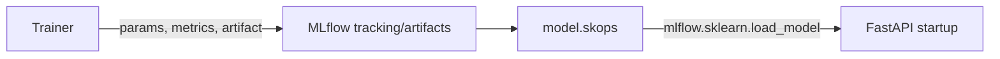

# MLflow

## Purpose

MLflow is used by the trainer for experiment tracking and by the API for loading the serialized sklearn pipeline. It is not deployed as a Compose service in this repository.

## Architecture / Concept



## Implementation

The configured experiment name is `flight_arr_delay_champion_model`. The committed artifact is:

```text
mlruns/4/models/m-6d479b8fd10a4744862b3b6ec29260d8/artifacts/
```

Metadata:

| Item | Value |
|---|---|
| Model ID | `m-6d479b8fd10a4744862b3b6ec29260d8` |
| Run ID | `5407198a78d545f4a3d1ded962e0ed07` |
| MLflow | `3.15.1` |
| scikit-learn | `1.9.0` |
| Python recorded in artifact | `3.11.9` |
| Serialization | skops |
| Artifact size | `10525697` bytes |

The artifact directory contains `MLmodel`, `model.skops`, `conda.yaml`, `python_env.yaml`, and `requirements.txt`. The trainer logs model parameters, train/test RMSE, MAE, R2, and `feature_importance.csv`.

## Configuration

Local code defaults to `MLFLOW_TRACKING_URI=http://127.0.0.1:5000` and a relative `MLFLOW_MODEL_URI`. The local `.env` changes the tracking URI to `sqlite:///mlflow.db`. Compose overrides only `MLFLOW_MODEL_URI` to `/app/model_artifact`; the Dockerfile copies the selected artifact into that path. A running MLflow server is not required for this local artifact load.

## Portability warning

`MLmodel` contains an old machine-specific Windows `artifact_path` (`file:///C:/Users/PC/...`). The API successfully loads the local artifact by its configured current path, but the embedded path documents where the artifact was created and is not portable. Use the packaged artifact directory or a proper MLflow artifact store rather than relying on that Windows path.

## Not implemented

There is no model registry promotion workflow, alias management in runtime, MLflow server Compose service, artifact upload command, or automated model replacement process.
