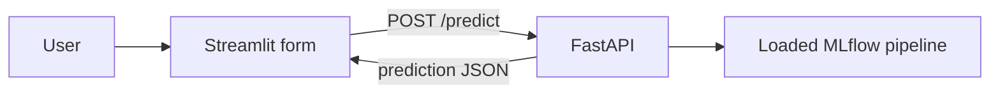

# Streamlit

## Purpose

`app/app.py` is a browser UI and thin HTTP client for FastAPI. It does not load the model or duplicate feature engineering.

## Architecture / Concept



## Implementation

The form collects carrier, origin, destination, flight date, scheduled departure and arrival times, distance, and scheduled duration. It maps those values to the exact `FlightRequest` names. The sidebar calls `/health`; an informational model view calls `/model`. Requests have a 10-second timeout and health/model checks are cached for 15 seconds.

The UI validates positive distance and duration and rejects identical origin/destination values before calling the API. API failures are converted into user-facing messages.

Carrier and airport selectors are static lists in `app/app.py`; they are not read from the model. The API can still receive other strings because the server-side encoder ignores unknown categories.

## Configuration

Local default: `API_URL=http://127.0.0.1:8000`. Compose sets `API_URL=http://api:8000`. Compose runs Streamlit on container port `1040` and publishes host port `1043`; local Streamlit's normal default is `8501` when no port is specified.

```bash
streamlit run app/app.py
```

## Troubleshooting

If the sidebar reports the API as unavailable, verify FastAPI is running and that `API_URL` is reachable from the process running Streamlit. Inside Compose, do not use `127.0.0.1:1041`; use `http://api:8000`.
