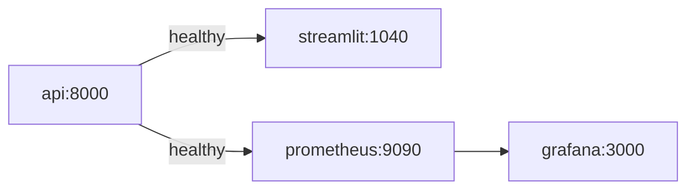

# Docker Compose

## Purpose

Compose runs the inference API, UI, Prometheus, and Grafana on one default network.

## Implementation

| Service | Container port | Host port | Purpose |
|---|---:|---:|---|
| `api` | 8000 | 1041 | FastAPI inference service |
| `streamlit` | 1040 | 1043 | Browser UI |
| `prometheus` | 9090 | 1042 | Metrics collection |
| `grafana` | 3000 | 1044 | Metrics visualization service |

Services use `restart: unless-stopped`. The API healthcheck calls `http://127.0.0.1:8000/health` every 10 seconds, with 5 retries and a 15-second start period. Streamlit and Prometheus depend on a healthy API. Grafana depends on Prometheus being started, not healthy.



Compose mounts `monitoring/prometheus/prometheus.yml` read-only with the SELinux `Z` label and stores Grafana data in the named `grafana_data` volume. No custom network is declared; Compose creates the project default network and provides service-name DNS.

## Commands

```bash
docker compose config
docker compose build
docker compose up -d
docker compose ps
docker compose logs api --tail=100
docker compose logs prometheus --tail=100
docker compose logs grafana --tail=100
docker compose down
```

## Configuration

The API image is built once and used by both `api` and `streamlit`; the Streamlit command overrides the image default. Compose sets `API_URL=http://api:8000` and `MLFLOW_MODEL_URI=/app/model_artifact`.

## Limitations

There is no explicit named network, resource limit, secret store, TLS termination, or automated Grafana provisioning. Published ports bind according to Docker's default host behavior; add host firewall controls before exposing the VPS publicly.
