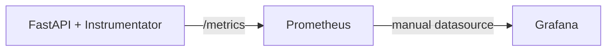

# Monitoring

## Purpose

The repository has a metrics collection path for FastAPI request/process instrumentation. It does not yet provide model-quality or business monitoring.

## Architecture / Concept

## Implementation

`src/api/main.py` calls `Instrumentator().instrument(app).expose(app)`, which exposes `/metrics`. Prometheus scrapes that endpoint every 15 seconds using the internal target `api:8000`. The Compose host port for Prometheus is `1042`.

The available metrics depend on the instrumentator's generated names and labels. The application does not define custom prediction-count, model-latency, drift, target-error, or data-quality metrics in its own code.

## Configuration

Prometheus configuration is mounted from `monitoring/prometheus/prometheus.yml`. Grafana has a persistent data volume but no repository-managed datasource, dashboard, panel, variable, or alert files.

## Limitations

Monitoring availability is not the same as model monitoring. There is no alert rule, retention policy, dashboard-as-code, external alert manager, or historical prediction/actual join. Grafana setup is manual and dashboard provisioning is not currently automated.
