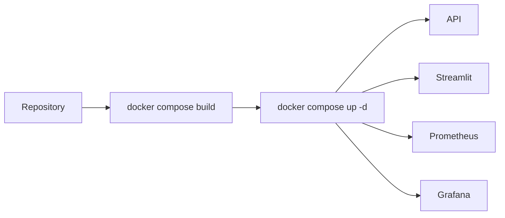

# Deployment

## Purpose

The implemented deployment path is Docker Compose on a Linux host. There is no automated deployment service.

## Architecture / Concept



## Prerequisites

- Linux host with Docker Engine and the Compose plugin.
- Sufficient disk space for the Python image and model artifact.
- Access to the repository and the committed artifact.
- Firewall rules for only the ports that should be public.

## Commands

```bash
docker compose build
docker compose up -d
docker compose ps
docker compose logs api --tail=100
docker compose logs streamlit --tail=100
docker compose logs prometheus --tail=100
docker compose logs grafana --tail=100
```

Verify from the host:

```bash
curl http://127.0.0.1:1041/health
curl http://127.0.0.1:1041/model
curl http://127.0.0.1:1042/-/ready
```

Use `http://<host>:1041/docs`, `http://<host>:1043`, and `http://<host>:1044` for API docs, Streamlit, and Grafana respectively when those ports are allowed through the firewall.

## Configuration

Compose supplies the API's model path and the Streamlit-to-API service URL. The model is copied into the image during build; changing a model requires rebuilding the image.

## Limitations

The Compose file publishes all four services and does not configure TLS, authentication, reverse proxying, resource limits, or image registry pulls. Treat direct public exposure as a deployment risk.
